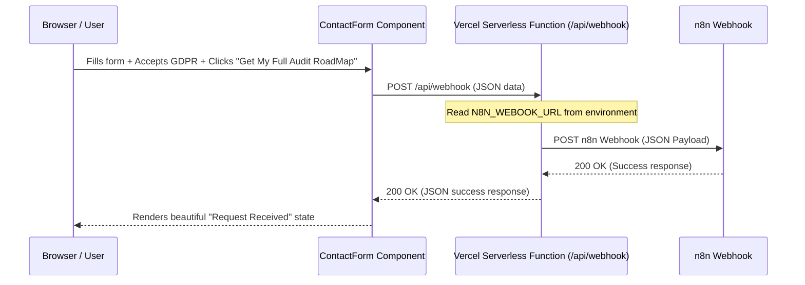

# Implementation Plan: n8n Webhook Integration

This document outlines the steps to replace the mock submission in the NexusFlow AI contact form with an API-based webhook submission to n8n using Vercel Serverless Functions.

## Overview
We will implement a secure, server-side forwarding mechanism to send lead data from the contact form on the landing page to an n8n webhook. This avoids CORS issues and protects the webhook URL from being exposed to the browser.

## Detailed Goals
1. **API Route**: Create a Next.js App Router API route under `/api/webhook` that runs on Vercel.
2. **Environment Variable**: Read `N8N_WEBOOK_URL` (or `N8N_WEBHOOK_URL`) securely from the server-side environment.
3. **GDPR Consent Checkbox**: Add a GDPR compliance checkbox to the `ContactForm` component.
4. **Form Logic**: Update `ContactForm` submission logic to call the new `/api/webhook` route and handle success/error states gracefully.
5. **Button text**: Update the submit button text to "Get My Full Audit RoadMap".

---

## Technical Details & Architecture



### 1. Next.js Serverless Route: `app/api/webhook/route.ts` [NEW]
We will create a new App Router handler:
- **Method**: `POST`
- **Payload Schema**:
  ```json
  {
    "firstName": "string",
    "lastName": "string",
    "email": "string",
    "company": "string",
    "companySize": "string",
    "industry": "string",
    "message": "string",
    "gdprConsent": true
  }
  ```
- **Webhook Forwarding**:
  - The handler reads the environment variable `N8N_WEBOOK_URL` (or fallback to `N8N_WEBHOOK_URL`).
  - Sends a `POST` request to the webhook URL using `fetch` with the payload and timestamps.
  - Handles errors (e.g. if the webhook is down, or if the environment variable is missing) and returns descriptive JSON responses.

### 2. Contact Form: `components/contact-form.tsx` [MODIFY]
We will update the form:
- **Fields**:
  - Add a `<Checkbox>` from `@/components/ui/checkbox` for GDPR consent.
  - Link the checkbox to a local state `gdprConsent`.
- **Button**:
  - Change the label to "Get My Full Audit RoadMap".
- **Handler**:
  - Update `handleSubmit` to perform `fetch` to `/api/webhook` with the JSON payload.
  - Add error message state and render error notifications if submission fails.
  - Use loading states during the API call.

---

## Steps to Deploy / Verify
1. **Environment Configuration**:
   - In development: Create a `.env.local` file containing:
     ```env
     N8N_WEBOOK_URL=https://your-n8n-instance.com/webhook/some-uuid
     ```
   - In production (Vercel): Add `N8N_WEBOOK_URL` as an Environment Variable in the project settings.
2. **Manual Testing**:
   - Fill out the form in development mode.
   - Verify that submitting without GDPR checkbox checked fails.
   - Submit and check if n8n receives the full payload.
